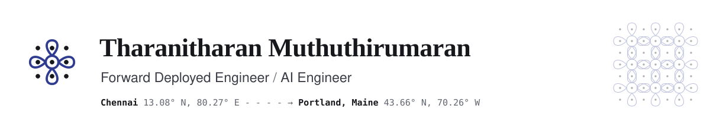

<picture>
  <source media="(prefers-color-scheme: dark)" srcset="assets/header-dark.svg">
  
</picture>

I build AI software next to the people who'll use it. I sit in on the work, find where it gets stuck, then build the fix and train the team to run it.

Right now I'm a forward deployed engineer at SUK Labs, an AI product studio in Portland, Maine. Before that I built LLM systems at Skillsoft and Steady State, and spent two years at Accenture in Chennai building for a US insurer.

### What I've shipped

| Where | What happened |
|:--|:--|
| **SUK Labs** | Forward Deployed Engineer · 2026 to now Cut request turnaround from **13 days to 4** for a nonprofit client's 300+ caseworkers with an intake app I built and deployed after on-site discovery. Added Google Cloud Vision OCR that ended manual spreadsheet entry for up to 600 requests a week. |
| **Steady State** | AI Engineer (Contract) · 2026 Built the backend and AI layer of an LLM coaching platform, with tool-calling and token streaming. Coaches approve every AI-proposed database write: **zero incorrect writes** across 6 weeks of live use. |
| **Skillsoft** | Software Engineer (Co-Op) · 2025 Cut OpenAI spend **13%** with prompt and context trimming, watched through LLM traces in Datadog. Launched an LLM quiz generator that saves 2 hours of authoring per course. |
| **Accenture** | Associate Software Engineer · 2021 to 2023 Made Chubb North America's APIs **23% faster** and resolved 150+ production defects in Java and SQL services. |

### Projects

| Project | What it is | Built with |
|:--|:--|:--|
| [**AuditPilot**](https://github.com/Tharanitharan-M/AuditPilot) | Open-source reference architecture for SOC 2 readiness reviews. An orchestrator agent drafts findings, an adversarial auditor agent cross-examines them, and a person approves before anything ships. Publishes `compliance-kb-mcp` on [PyPI](https://pypi.org/project/compliance-kb-mcp/) and [npm](https://www.npmjs.com/package/@auditpilot/compliance-kb-mcp), with hybrid pgvector and BM25 search over 324 NIST 800-53 controls. CI fails on any quality drop over 2% across 100 hand-labeled eval cases. | LangGraph, MCP, FastAPI, pgvector, Promptfoo, RAGAS, Langfuse |
| [**Mentivo**](https://github.com/Tharanitharan-M/mentivo) · [live](https://mentivo-flame.vercel.app) | AI coding mentor that builds a 7-milestone roadmap and checks understanding with adaptive quizzes. 8 versioned prompts, traced in Langfuse and OpenTelemetry across 16 API routes. | Next.js, Gemini, Vercel AI SDK, Langfuse |
| [**E-Commerce AI App**](https://github.com/Tharanitharan-M/ecommerce) · [live](https://furniture-ecommerce-one-ashen.vercel.app) | Storefront with a Gemini shopping assistant that searches products, looks up orders, and checks out. 70 tests with 90%+ coverage on the payment path. | Next.js, Stripe, Clerk, Vitest, Playwright |
| [**Horizon Banking**](https://github.com/Tharanitharan-M/Horizon-Banking-Platform) | Banking app with Plaid account linking and transfers, Zod validation, and Sentry error tracking. | Next.js, TypeScript, Plaid, Appwrite |
| [**NBA Analytics**](https://github.com/Tharanitharan-M/nba-analytics-platform) | Spring Batch ETL over 65,000+ games. Dashboard queries dropped from 2s to 200ms across 13M+ rows. | Java, Spring Boot, PostgreSQL |

### Toolkit

| Area | Tools |
|:--|:--|
| AI engineering | LLM applications, agentic workflows, LangGraph, MCP, tool-calling, RAG, Claude Code, OpenAI, Anthropic and Gemini APIs |
| Evals and observability | Promptfoo, RAGAS, LLM-as-judge, Langfuse, OpenTelemetry, Datadog, Grafana, Sentry |
| Full-stack | TypeScript, Python, Java, SQL, React, Next.js, NestJS, Node.js, GraphQL, FastAPI, Spring Boot |
| Data | PostgreSQL, pgvector, Neon, Firebase, Redis, Kafka |
| Cloud and DevOps | AWS, GCP, Azure, Docker, Terraform, GitHub Actions, Jenkins |

### Credentials

**Claude Academy by Anthropic**, completed September 2026 
[Building with the Claude API](https://academy.claude.com/badges/ae318af3-bee9-4181-ad45-f8f9871d315a) · [Claude Code 101](https://academy.claude.com/badges/d93190e1-bf91-47b4-9f00-158e7e6d1b61) · [Introduction to Model Context Protocol](https://academy.claude.com/badges/2e86b98f-beb1-4500-9a44-f4825a55323d) · [Model Context Protocol: Advanced Topics](https://academy.claude.com/badges/b269e315-426a-4b36-8ed8-996303f317dc) · [AI Fluency: Framework and Foundations](https://academy.claude.com/badges/b81d5ba5-afd2-45a8-bfee-54bf7d79596c) · [Building Effective Human-Agent Teams (beta)](https://academy.claude.com/badges/4b3452e1-83ea-4aec-a571-18b1a698088c)

**Certifications** 
[AWS Certified Cloud Practitioner](https://www.credly.com/badges/03fc2ebc-aa51-4a8f-8274-c8821ba51a4b/linked_in_profile) · [Microsoft Azure Fundamentals (AZ-900)](https://learn.microsoft.com/en-us/users/tharanitharanmuthuthirumaran-6876/credentials/1ff779dc01930b8e)

**Education** 
MS Computer Science, Northeastern University (Roux Institute), 3.9 GPA, 2026 
BE Electrical and Electronics Engineering, Anna University, 2021

---

Built in Portland, Maine. Started in Chennai. Open to forward deployed and AI engineering roles anywhere in the US.
